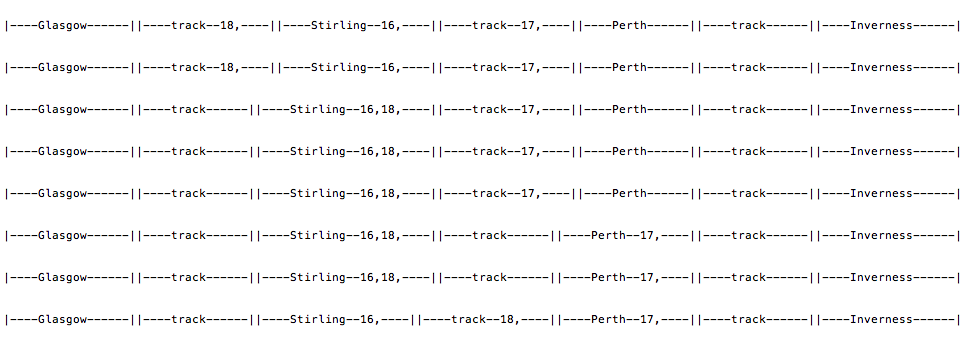

% AP(IT) 2018-2019 - Coursework Description
% Simon Rogers
% 28th January 2019

# Introduction

 - Imagine you are part of a team building a railway simulator (perhaps to be used to help build a new railway).
 - The simulator will allow trains to move through segments of track and stations.
 - Segments of track can only have one train in them at a time
 - Stations can have multiple trains in them at a time
 - The train company has two types of trains: express (fast) and local (slow)
 - Each track segment / station has a length: $l$. This should be in metres. A typical segment might be 1,000 m long. A station 100m.
 - Each train has a speed: $s$. Fast trains travel at 500 metres per second (wow!). Slow ones at a mere 10 metres per second.
 - The time a train is in any segment is $l/s$
 - The time a train is in a staion is $l/s$ + 5 (they stop for 5 seconds -- people have to get on and off quickly!)
 - When the time is up (i.e. the train is at the end of the segment or has finished in a station), it can only move into the next segment if there is space. Space is determined by capacity. I.e. a station with capacity 3 can have 3 trains in it at once. Segments can only have one train in them at once.

 

 For example, in Figure 1 there are three stations (with capacities 3,2, and 2) and two track segments.

# What you need to create

Consider only tracks that have a start (left) and end (right). In other words, each station or piece of track succeeds only one other station / track and precedes only one other. Trains only travel in one direction (e.g. left to right in the picture).

  - Train objects (each should run on its own thread)
  - Track and station objects
  - An object that creates trains and randomly puts them into the first bit of track / station (should be on another thread and should continue indefinitely). (Use random delays between trains, and randomly choose which type of train)
  - An object that continually prints out the status of the railway (e.g. see screenshot below).
  - You should use `conditions` and `locks` to implement the constraints on the number of trains in any given section. E.g. a train can only enter a segment / station when there is space. This must be enforced with `Conditions`, `await` and `signal` or `signalAll`

  

# What you should submit

 - A description of the classes and class hierarchies that you have designed and built. This can be in the form of a UML class diagram or some text. This should be a separate document to your code. Submit a .pdf. One page ought to be sufficient. It should be clear enough that someone else could easily modify or extend your classes. If using UML, feel free to annotate it. I will not be marking the _correctness_ of the use of UML, just the clarity.
 - Your code. Just .java files please. If you're using Eclipse, remove the `package` line from the top so that I can compile from the command line.
 - Your code should include a main (in a file `Runme.java`) that creates some sections (including at least 2 each of stations and track segments), links them together and starts all of the necessary threads. This is what I will run to see your system in action.
 - When I unzip your code I will type: `javac *.java` and then `java Runme`. If this doesn't work, I will make every effort to get it to work but you will lose marks. So, **no packages**
 - All of these files (the .java files and the .pdf) should be zipped up and submitted via Moodle. As a **zip**. Not a **7z** or a **rar** or whatever else.

# How you will be assessed

The mark awarded will be out of 30 (it's 30\% of the course....). Of this, 10 will be for the design, and 20 for the code. For the design, marks will be awarded for:

 - Clarity
 - Demonstrating the understanding of inheritance
 - Locks / conditions being in a sensible place and efficiently used (e.g. only waking up the trains that could possibly do something)
 - Sensibly designed objects (e.g. objects that could be re-used, lack of code being repeated etc, correct use of abstract classes / interfaces as appropriate)

For the code, marks will be awarded if:

 - It compiles and runs (please)
 - It fulfills the requirements as described above (see note below)
 - It is neat, easy to follow and well commented
 - It conforms to Java naming conventions
 - Correct use of object declarations (e.g. `static` and `final`)

If you are unable to create something that fulfills all of the requirements, don't panic. Marks will still be awarded for a solution that fulfills some of the requirements. For example, if you can make a system that does everything except restrict the number of trains in each section (probably the hardest bit), you can still get a  good mark. Try and ensure you do submit something that will compile and will run, even if it is not fully functional. Feel free to add comments to your code describing functionality that you weren't able to implement.

# Deadline

5:30pm, Tuesday 5th March 2019

# Hints

A few hints:

- There are a couple of places here in which inheritance is sensible.
- Build the system up, testing as you go. The locking bit is the trickiest bit so tackle that first.
- Much confusion about locks and conditions is removed once you clarify what the _shared object_ is.
- **Remember**: this is worth 30% of the course. Failure to make any effort will mean you have attempted less than 75% and will not be eligible for credit.
